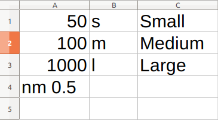

# pcounts

### Installation

Download the version of Node.js that corresponds to your machine by clicking [this link](https://nodejs.org/en/download/), and install Node.js on your machine. Then, open your commandline and type  

```bash 
  npm install -g pcounts 
```

To install updates when they become available, type 

```bash 
  npm upgrade -g pcounts 
```

### Usage

```haskell
pcounts [options] {directory|image}
  options:
    -s, --minsize requires integer - minimum particle size (pixels)
    -S, --maxsize requires integer - maximum particle size (pixels)
    -c, --mincircularity requires real number between 0 and 1
    -C, --maxcircularity requires real number between 0 and 1
    -u, --userdefined requires a .csv file with user defined size gradings
    -n, --nm requires positive real number - number of nanometres per pixel
    -m, --um requires positive real number - number of microns per pixel
```

For each file that is processed, output is:

```bash
*********************************************
Image name: image.{png|jpg|jpeg|...}    
|____Particle count (total): c_1 + ... + c_N
|	|____size_1 (0 - smallest_area): c_1
|	.
|   .
|   .
|	|____size_N (>largest_area): c_N
|
|____Percentage contaminated: xxx.xx%
*********************************************
```

### Arguments

The program ```pcounts``` has one mandatory argument and several  optional ones. The mandatory argument is either the ```directory``` where images are held, or a single ```image```. If the input is an ```image```, the program will store the results of the analysis in a CSV file in the current directory. However, if the input is a ```directory```, a new folder called ```counts/``` will be created as a subdirectory to the input directory, and all CSV files generated for the images in the directory will be stored here. This file will contain the total number of particles counted in the filename.

Optional arguments can be passed into the program by using the defined flags. By default, ```pcounts``` will detect particles of any size and any circularity, and grade them into three classes: Small, Medium and Large particles. The default measurement unit is pixels. However, these can all be changed to the liking of the user by passing in the parameters as shown in the image above. 

### User defined particle sizes

By using the ```--userdefined``` flag and providing a suitably formatted .csv file, the user can specify a custom list of meaningful sizes and labels instead of using the default small, medium, large labels. A properly formatted csv file looks like this:



The first column ( A ) contains particle areas that correspond to the labels in the next two columns. The last item in this column tells the program the units of the areas, as well as the scaling factor - the number of nanometres to a pixel. In this case, there are 0.5 nanometres to a pixel, and therefore the areas in column A are in nanometres. Small particles are ones that have an area between 0-50nm, medium particles are ones that have an area between 50-100nm and so on. 

The second column ( B ) contains the abbreviations for the labels (these are used internally by the program). 

Finally, the third column  ( C ) contains the long, readable version of the label (this is displayed to the user). 

It is very important to note that:

- There must be exactly **three columns** in the CSV file
- Not counting the last entry for column A, the columns must be of the **same length**
- The particle areas in column A must go down in **ascending order**
- The last entry of column A must contain a unit (``px``, ``nm``, ``um`` **only**) and a **real number separated by a space**
- With the exception of its last entry, column A must only be used for specifying particle areas **as positive integers**. No special characters (periods, commas, spaces) are allowed.

### Examples

To count the particles on an image called ``wafer.jpeg`` , but only if they are bigger than 600px<sup>2</sup> in area: 

```c
pcounts wafer.jpg --minsize=600
```

To count the particles on an image called ``wafer.jpeg`` , but only if they are perfect circles and smaller than 50nm<sup>2</sup> in area, and assuming  there are 0.45 nanometres to a pixel: 

```c
pcounts wafer.jpg --maxsize=50 --nm=0.45 --mincircularity=1.0
```

To process all the images in a directory called ``allimages``, and grade the particles according to a user specified CSV file ``mylabels.csv``: 

```c
pcounts allimages --userdefined="mylabels.csv"
```

## IMPORTANT

- When using pcounts on a Windows machine use ``\`` to separate directories instead of ``/`` which is the default on Unix machines.
- When passing file paths that have spaces in them, enclose them in double quotes like: ``“this is\a path\with spaces”``